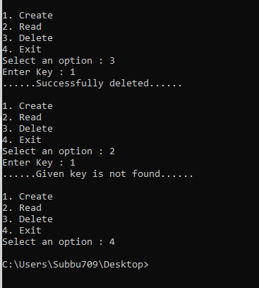
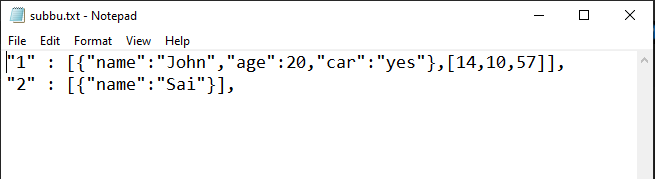

# FreshworksProblem
- The code is in python programming language of version 3
- Install python of version 3
- Make sure that you have all packages install that used in the code.
- See the 2-5 lines in code and these are the required packages.
- Make sure to install them before using the code.
- To run the Main.py file, use command "python Main.py" in the directory where the Main.py file is present.
# Output Images : 
# Output1

# Output2

# Text file image
- First line have Time-to-Live property
- Second line don't have TTL property

